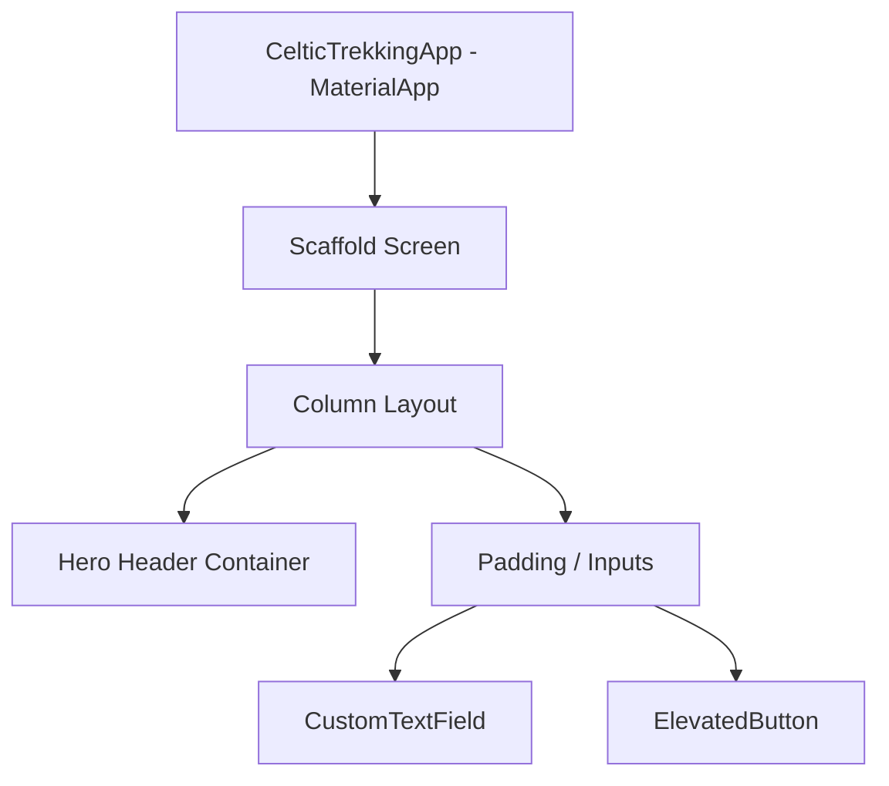
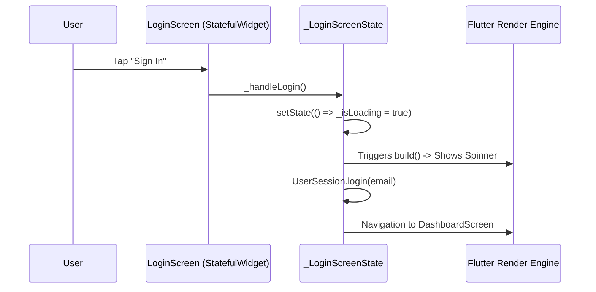

# 📚 Flutter Beginner's Complete Concept & Code Breakdown

This document breaks down every folder, file, Dart syntax feature, and Flutter architectural pattern implemented in your **Celtic Trekking** project.

---

## 📑 Table of Contents
1. [Core Flutter Concepts for Beginners](#1-core-flutter-concepts-for-beginners)
2. [Folder Architecture & Why We Split Files](#2-folder-architecture--why-we-split-files)
3. [File-by-File Deep Dive & Syntax Explained](#3-file-by-file-deep-dive--syntax-explained)
   - [A. Entry Points: main.dart & app.dart](#a-entry-points-maindart--appdart)
   - [B. Constants Layer (Design Tokens)](#b-constants-layer-design-tokens)
   - [C. Data Models & State Layer](#c-data-models--state-layer)
   - [D. Reusable Widgets Layer](#d-reusable-widgets-layer)
   - [E. Screens Layer (Auth & Dashboard)](#e-screens-layer-auth--dashboard)
4. [Essential Dart Syntax Explained](#4-essential-dart-syntax-explained)
5. [Widget Lifecycle & State Management](#5-widget-lifecycle--state-management)

---

## 1. Core Flutter Concepts for Beginners

### "Everything is a Widget"
In Flutter, every UI element is a **Widget** — whether it's a visible button (`ElevatedButton`), an invisible layout controller (`Row`, `Column`, `Padding`), or the entire application wrapper (`MaterialApp`).



### Declarative UI (Flutter) vs Imperative UI (HTML/DOM)
* **Imperative (Traditional JS/DOM)**: You find an element `document.getElementById('title')` and mutate it `element.innerText = 'Hello'`.
* **Declarative (Flutter)**: You declare what the UI should look like for a given **State**. When state changes, you call `setState()` and Flutter rebuilds only the parts that changed.

---

## 2. Folder Architecture & Why We Split Files

### ❌ The Monolithic Anti-Pattern (Before)
Putting everything into a single 1,380-line `main.dart` causes:
- High risk of merge conflicts when collaborating.
- Difficult code reuse (e.g. recreating the same textfield or button on multiple screens).
- Poor testability and hard-to-find bugs.

### ✅ Layer-First Architecture (Current)

```text
lib/
├── main.dart              -> The minimal bootstrapper
├── app.dart               -> App-level theme & screen routing
├── constants/             -> Single source of truth for design tokens
├── models/                -> Data objects & business logic state
├── widgets/               -> Reusable UI bricks (buttons, cards, inputs)
└── screens/               -> Full-page layouts combining widgets
```

---

## 3. File-by-File Deep Dive & Syntax Explained

---

### A. Entry Points: `main.dart` & `app.dart`

#### 1. [`lib/main.dart`](file:///home/nishchal/Documents/Projects/demo/lib/main.dart)
```dart
import 'package:flutter/material.dart';
import 'app.dart';

void main() {
  WidgetsFlutterBinding.ensureInitialized();
  runApp(const CelticTrekkingApp());
}
```
* **`void main()`**: The starting execution function of every Dart application.
* **`WidgetsFlutterBinding.ensureInitialized()`**: Ensures Flutter engine communication channels are ready before running the app.
* **`runApp(...)`**: Takes the root widget and attaches it to the screen.

---

#### 2. [`lib/app.dart`](file:///home/nishchal/Documents/Projects/demo/lib/app.dart)
```dart
enum AppScreen { login, register, dashboard }
```
* **`enum` (Enumeration)**: Defines a fixed list of screen states (`login`, `register`, `dashboard`) instead of error-prone string literals like `"login"`.
* **`MaterialApp`**: Configures Material Design 3 theme, navigation, and fonts.
* **`LayoutBuilder & builder`**:
  ```dart
  if (constraints.maxWidth > 500) {
    // Renders the realistic 390x844 mobile phone bezel with ambient background
  }
  ```
  This creates the mobile frame simulation for testing on desktop or web.

---

### B. Constants Layer (Design Tokens)

#### [`lib/constants/app_colors.dart`](file:///home/nishchal/Documents/Projects/demo/lib/constants/app_colors.dart)
```dart
class AppColors {
  static const Color navy = Color(0xFF011231);
  static const Color gold = Color(0xFFD4A843);
  static const Color offWhite = Color(0xFFF5F7FA);
}
```
* **`static const`**: Values are stored once in memory and compiled at build time (maximum performance).
* **`0xFF011231`**: The `0xFF` represents 100% opacity (Alpha `FF`), followed by the hex color code `011231`.

#### [`lib/constants/app_styles.dart`](file:///home/nishchal/Documents/Projects/demo/lib/constants/app_styles.dart)
Contains reusable `TextStyle` definitions (e.g. `heading1`, `sectionTitle`, `subtitle`) and `BoxShadow` presets so styles stay uniform across the entire app.

---

### C. Data Models & State Layer

#### 1. [`lib/models/destination_item.dart`](file:///home/nishchal/Documents/Projects/demo/lib/models/destination_item.dart)
```dart
class DestinationItem {
  final String id;
  final String name;
  final double rating;
  final int trekCount;
  final String imageUrl;

  const DestinationItem({
    required this.id,
    required this.name,
    required this.rating,
    required this.trekCount,
    required this.imageUrl,
  });
}
```
* **`final`**: Properties cannot be modified after object creation (immutable data).
* **`required this.name`**: Named parameters that must be supplied when creating an instance.

---

#### 2. [`lib/models/user_session.dart`](file:///home/nishchal/Documents/Projects/demo/lib/models/user_session.dart)
```dart
class UserSession extends ChangeNotifier {
  static final UserSession _instance = UserSession._internal();
  factory UserSession() => _instance;
  UserSession._internal();
  ...
  void login({required String email}) {
    _isLoggedIn = true;
    _email = email;
    notifyListeners(); // 🔔 Tells listening widgets to rebuild!
  }
}
```
* **Singleton Pattern (`_instance`)**: Guarantees only one user session exists across the entire app.
* **`ChangeNotifier`**: A Dart class that notifies observers when data changes.
* **`notifyListeners()`**: When called, any widget listening via `ListenableBuilder` instantly updates with the new user name/avatar!

---

### D. Reusable Widgets Layer

#### 1. [`lib/widgets/common/custom_text_field.dart`](file:///home/nishchal/Documents/Projects/demo/lib/widgets/common/custom_text_field.dart)
```dart
class _CustomTextFieldState extends State<CustomTextField> {
  bool _obscureText = true;
  bool _isFocused = false;
  ...
```
* **`Focus`**: Detects when the user clicks inside or outside the text box to animate the navy border and glowing shadow.
* **`obscureText`**: Masks passwords (`••••`). Toggled by tapping the eye icon.

#### 2. [`lib/widgets/common/app_toast.dart`](file:///home/nishchal/Documents/Projects/demo/lib/widgets/common/app_toast.dart)
```dart
ScaffoldMessenger.of(context).showSnackBar(
  SnackBar(
    behavior: SnackBarBehavior.floating,
    margin: EdgeInsets.only(bottom: MediaQuery.of(context).size.height - 160),
    ...
  )
);
```
* Displays a floating top pill notification for feedback (e.g. *"Welcome back!"*, *"Invalid email"*).

#### 3. [`lib/widgets/dashboard/destination_carousel.dart`](file:///home/nishchal/Documents/Projects/demo/lib/widgets/dashboard/destination_carousel.dart)
```dart
ListView.separated(
  scrollDirection: Axis.horizontal,
  itemCount: destinations.length,
  separatorBuilder: (_, _) => const SizedBox(width: 12),
  itemBuilder: (context, index) { ... }
)
```
* **`ListView.separated`**: Renders items horizontally on demand as the user scrolls, conserving memory.
* **`errorBuilder`**: Fallback placeholder if image loading fails.

---

### E. Screens Layer (Auth & Dashboard)

#### 1. [`lib/screens/auth/login_screen.dart`](file:///home/nishchal/Documents/Projects/demo/lib/screens/auth/login_screen.dart)
* **Form Validation**:
  ```dart
  if (!RegExp(r'^[^\s@]+@[^\s@]+\.[^\s@]+$').hasMatch(email)) {
    AppToast.show(context, 'Invalid email address', isError: true);
    return;
  }
  ```
* **Async Network Simulation**:
  ```dart
  setState(() => _isLoading = true);
  await Future.delayed(const Duration(milliseconds: 900));
  ```
  Shows a circular spinner while logging in.

---

#### 2. [`lib/screens/auth/register_screen.dart`](file:///home/nishchal/Documents/Projects/demo/lib/screens/auth/register_screen.dart)
* **Real-Time Password Strength Meter**:
  Checks 4 criteria (Length >= 8, Uppercase + Lowercase, Number, Special Character) and fills 4 color-coded bars:
  - 1: 🔴 Weak (`AppColors.error`)
  - 2: 🟠 Fair (`AppColors.warning`)
  - 3: 🟡 Good (`AppColors.gold`)
  - 4: 🟢 Strong (`AppColors.success`)

---

#### 3. [`lib/screens/dashboard/dashboard_screen.dart`](file:///home/nishchal/Documents/Projects/demo/lib/screens/dashboard/dashboard_screen.dart)
* Uses **`ListenableBuilder`** to reactively listen to `UserSession()`. When a user logs in, their name automatically displays as *"Hey, [Name]"* with their initial avatar letter.

---

## 4. Essential Dart Syntax Explained

| Syntax | What it means | Example |
|---|---|---|
| `final` | Variable can only be set once at runtime | `final String name = 'Hillary';` |
| `const` | Constant known at compile time (fastest performance) | `const Color gold = Color(0xFFD4A843);` |
| `?` (Nullable) | Value can be null | `String? destination;` |
| `!` (Null Assertion)| Promise to Dart that value is not null | `destination!.toUpperCase()` |
| `??` (Default) | Fallback value if null | `final title = customTitle ?? 'Default';` |
| `async / await` | Handles asynchronous tasks without blocking UI | `await Future.delayed(...)` |
| `=>` (Arrow) | Shorthand for single-line return | `String get name => _name;` |

---

## 5. Widget Lifecycle & State Management



### Key State Methods:
1. **`initState()`**: Runs once when widget is first created (ideal for setting up controllers or listeners).
2. **`build(context)`**: Runs whenever `setState()` or inherited dependencies change to return the widget tree.
3. **`dispose()`**: Runs when the screen is removed from screen history. Always call `.dispose()` on `TextEditingController` to prevent memory leaks!

---

## 💡 Summary of Key Takeaways

1. **Keep `main.dart` thin**: Only initialize and launch the app.
2. **Group by responsibility**: Styles in `constants/`, data in `models/`, reusable widgets in `widgets/`, and full views in `screens/`.
3. **Use `StatefulWidget` only when state changes**: If UI is static, prefer `StatelessWidget` for better performance.
4. **Always dispose controllers**: Protect device memory.
