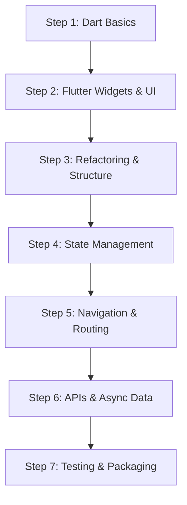

# 🚀 Flutter Beginner Roadmap & Project Architecture Guide

Welcome to Flutter! This guide provides an assessment of your current project structure, a recommended architecture for scaling your code, and a structured, step-by-step learning roadmap.

---

## 1. Assessment of Your Current Project

### Current State
* **Root level**: Standard Flutter setup with platform folders (`android/`, `ios/`, `linux/`, `macos/`, `web/`, `windows/`) and configuration files (`pubspec.yaml`, `analysis_options.yaml`).
* **`lib/` folder**: Currently, the entire app (UI, models, mock data, widgets, and logic) is contained in a single 1,380+ line file: `lib/main.dart`.

### Is it organized?
While single-file setups are fine for quick prototypes, real-world Flutter apps break code into modular, reusable files and folders. Keeping everything in `main.dart` makes it difficult to maintain, test, and collaborate on.

---

## 2. Recommended Folder Structure

Here is the industry-standard **Layer-First** architecture recommended for this app:

```text
lib/
├── main.dart                      # App entry point (initialization & runApp)
├── app.dart                       # MaterialApp configuration & theme setup
├── constants/                     # Colors, styles, dimensions, strings
│   ├── app_colors.dart
│   └── app_styles.dart
├── models/                        # Data classes / models
│   └── trek_item.dart
├── screens/                       # Full page views
│   ├── dashboard_screen.dart
│   ├── trek_detail_screen.dart
│   └── favorites_screen.dart
├── widgets/                       # Reusable UI components
│   ├── category_filter_bar.dart
│   ├── trek_card.dart
│   └── rating_badge.dart
└── services/                      # API calls, database, or mock repositories
    └── trek_repository.dart
```

---

## 3. Step-by-Step Flutter Learning Roadmap



### 🔹 Step 1: Dart Fundamentals
Before diving deeper into UI, ensure comfort with Dart essentials:
- **Variables & Types**: `String`, `int`, `double`, `bool`, `List`, `Map`, `Set`.
- **Null Safety**: `String?` (nullable), `!` (null assertion), `??` (default operator).
- **Object-Oriented Programming**: Classes, constructors, named parameters, inheritance, `final` vs `const`.
- **Async Programming**: `Future`, `async`/`await`, `Stream`.

### 🔹 Step 2: Widget Tree & UI Fundamentals
In Flutter, **everything is a widget**.
- **Stateless vs Stateful**:
  - `StatelessWidget`: Static UI that does not change over time (e.g., icons, text).
  - `StatefulWidget`: Dynamic UI that rebuilds when state changes via `setState()`.
- **Core Layout Widgets**:
  - `Row` (horizontal) & `Column` (vertical)
  - `Container`, `Padding`, `SizedBox`
  - `Stack` & `Positioned` (overlapping widgets)
  - `ListView.builder` (scrollable lists) and `GridView.builder` (grid layouts)
  - `Scaffold` (provides standard Material app layout with AppBar, BottomNavigationBar, Body).

### 🔹 Step 3: Project Modularization (Hands-on with this Project)
Practice by breaking down your current `lib/main.dart`:
1. **Extract Models**: Move `TrekItem` class to `lib/models/trek_item.dart`.
2. **Extract Theme & Constants**: Move colors (`0xFF1E5631`, `0xFFD4AF37`) to `lib/constants/app_colors.dart`.
3. **Extract Screens**: Move `MainDashboardScreen` to `lib/screens/dashboard_screen.dart`.
4. **Extract Cards**: Move reusable trek card widgets into `lib/widgets/trek_card.dart`.

### 🔹 Step 4: State Management
As applications grow beyond `setState()`, state management helps share data between screens without passing variables manually through constructors.
- **Beginner**: `setState()` and `ValueNotifier`
- **Intermediate**: `Provider` or `Riverpod`
- **Advanced / Enterprise**: `Bloc` (Business Logic Component)

### 🔹 Step 5: Navigation & Routing
- Basic Navigation: `Navigator.push()` and `Navigator.pop()`
- Modern Named & Declarative Routing: `go_router` package for deep-linking and web/mobile history management.

### 🔹 Step 6: Networking & APIs
- Fetch data from REST APIs using the `http` or `dio` package.
- Convert JSON to Dart objects (`jsonDecode` + `fromJson` factory methods).
- Handle loading, success, and error states gracefully in UI with `FutureBuilder`.

### 🔹 Step 7: Local Storage & Persistence
- Simple key-value storage: `shared_preferences` (e.g. user theme preferences, token).
- Offline databases: `isar`, `hive`, or `sqflite` (e.g. saving offline treks).

---

## 4. Daily Developer Workflow & Hot Reload Cheat Sheet

| Action | Shortcut (in Terminal) | Description |
|---|---|---|
| **Hot Reload** | `r` | Injects code updates into the running Dart VM instantly without resetting state. |
| **Hot Restart** | `R` | Rebuilds app state and restarts the app lifecycle. |
| **Quit** | `q` | Terminates the running Flutter session. |
| **Format Code** | `dart format .` | Automatically formats Dart code according to official guidelines. |
| **Analyze** | `flutter analyze` | Detects syntax errors, warnings, and lint suggestions. |

---

## 5. Next Practical Step
Try extracting the `TrekItem` model out of `main.dart` into a new file `lib/models/trek_item.dart` and importing it back into `main.dart` with:
```dart
import 'models/trek_item.dart';
```
This is your first step toward building clean, production-ready Flutter applications!
